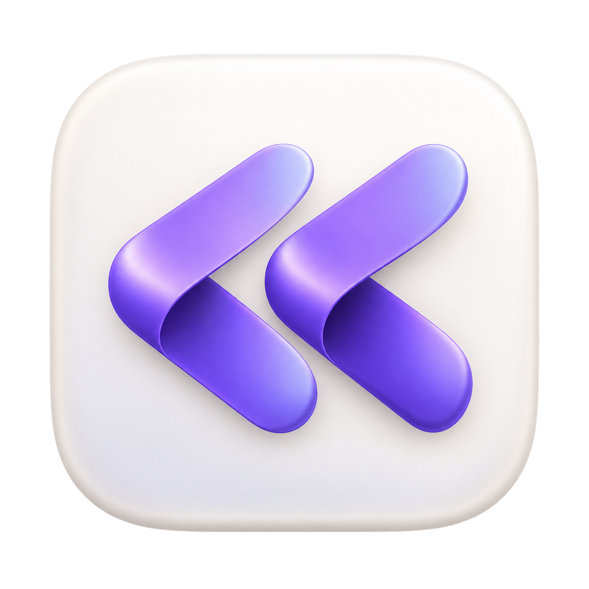
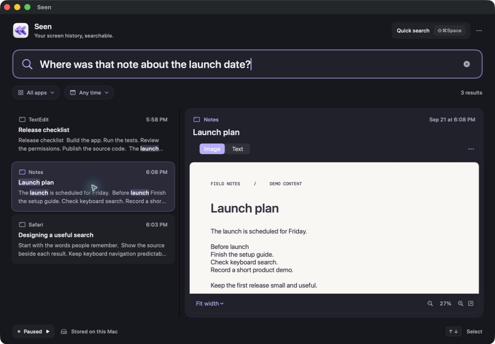

<p align="center">
  
</p>
<h1 align="center">Seen</h1>
<p align="center">Ask about something you saw on your Mac.</p>
<p align="center">
  <a href="https://github.com/LufeMC/seen/actions/workflows/ci.yml"></a>
  <a href="LICENSE"></a>
  
</p>

> “What was that tweet about TypeSafe being a data shop?”

Press **Shift-Command-Space**. Ask your question. Open the saved screen.

Seen captures your Mac, recognizes its text, and makes that history searchable.
With your own API key, **Jev ranks search results automatically**. Local search works without a key and provides a fallback when Jev fails.



## What it does

- Captures connected displays and available app windows, including windows on other macOS desktops.
- Uses Apple's Vision framework for local text recognition.
- Searches from any app with **Shift-Command-Space**.
- Shows the captured image, recognized text, app, and time.
- Uses Jev through **TypeSafe** or **Vercel AI Gateway**, with your own key.
- Stores API keys in macOS Keychain.
- Starts recording when Seen opens. **Command-Q** hides the interface and keeps the shortcut and recording active.
- Keeps up to **seven days or 5,000 captures** by default, whichever limit is reached first.

This is an early source release. It has no hosted backend, account system, audio recording, or telemetry.

## Build and run

Requirements: **macOS 14 or later**, **Swift 6 or later**, and an installed Xcode toolchain.

```sh
git clone https://github.com/LufeMC/seen.git
cd seen
bash scripts/build-app.sh
open dist/Seen.app
```

1. Allow Screen Recording when macOS requests it.
2. If macOS requests a restart, reopen Seen.
3. Press **Shift-Command-Space** to search.

The source release has no notarized installer. The build script uses an available Apple Development certificate, or an ad hoc signature.
Set `CODE_SIGN_IDENTITY` to select a certificate. A stable signing identity helps preserve macOS permissions between builds.
Quit Seen completely before replacing its executable. Do not reset Screen Recording permissions as a routine build step.

To build with an ad hoc signature explicitly:

```sh
CODE_SIGN_IDENTITY=- bash scripts/build-app.sh
```

## Enable Jev

1. Open **Seen → Settings → Optional Jev search**.
2. Select **TypeSafe** or **Vercel AI Gateway**.
3. Enter your provider's API key.
4. Select **Save key**.

Jev then becomes the primary search method. Enter a full question in either search field.
Seen waits briefly after typing stops, then sends one evaluation request. It does not require a separate search button.
If the request fails, Seen shows local results and an error message. Remove the saved key to return to local-only search.

| Provider | Model | Endpoint | Account setup |
| --- | --- | --- | --- |
| TypeSafe | `jev-latest` | `https://api.typesafe.ai/v1/systemone` | [TypeSafe](https://typesafe.ai), [API reference](https://docs.typesafe.ai/api) |
| Vercel AI Gateway | `typesafe-ai/jev` | `https://ai-gateway.vercel.sh/v1/evaluate` | [Gateway authentication](https://vercel.com/docs/ai-gateway/authentication-and-byok/authentication), [evaluation API](https://vercel.com/docs/ai-gateway/modalities/evaluation) |

**Saving a key enables automatic text uploads for searches.** Each request contains your query, app names, titles, and text from up to 32 candidate captures.
Images, saved page URLs, local file paths, and internal capture identifiers are excluded. Provider charges and data policies apply.
No developer key is included. No separate Vercel deployment is required.

### Search boundaries

Jev evaluates relevance. It does not generate chat answers or invent page links.
Seen uses a local text index to find up to 24 candidates, then adds recent captures, with duplicates removed and a 32-capture limit.
Jev orders those candidates by relevance. App and date filters apply before candidate selection.

Each candidate includes up to 1,600 text characters, 200 title characters, and 100 app-name characters. Queries are limited to 500 characters per request.
Jev does not scan the entire archive on every question. A question with no useful matching words can miss older captures.
Add a remembered name or phrase if the result is absent. This release does not include an embedding index.

## Keyboard and recording controls

| Control | Action |
| --- | --- |
| Shift-Command-Space | Open or close quick search from any app |
| Up / Down | Select a result |
| Return | Open the selected quick-search preview |
| Escape | Leave a preview, then close quick search |
| Command-F | Focus the history search field |
| Command-Q | Hide Seen; keep recording and quick search active |
| Option-Command-Q | Quit Seen completely |
| Command-Shift-R | Start or pause recording while Seen is active |
| Command-comma | Open Settings |

Seen runs as a menu bar app and does not appear in the Dock.
The menu bar provides recording controls and **Quit Seen Completely**.
A complete quit ends recording and the global shortcut. Closing a window does not quit Seen.
Recording starts by default when the app opens. Settings can disable this behavior.
Seen does not install a login item. A manual pause lasts until recording restarts or the app reopens.

## Capture scope and limits

Seen starts a capture cycle about every five seconds, when processing permits. Unchanged images are skipped before recognition.
Each display and each available window counts as a separate capture. Images have a maximum width of 2,560 pixels.

Active desktops are captured as complete display images. Other desktops are represented by available individual windows.
Seen does not switch desktops. macOS can omit protected, minimized, or suspended windows, or provide stale content.
The menu bar reports capture failures. It cannot report windows that macOS omits from its window list.

Optional Accessibility permission enables page-link retrieval when the focused browser exposes its address.
A feed address is not an individual post address. Seen only offers **Open page** when a supported link was saved.

Private browser windows are not detected automatically. Use the exclusion list or pause recording before viewing content that must not be saved.

## Storage and privacy

History stays in this folder:

```text
~/Library/Application Support/RewindButFast/
```

The internal directory and bundle identifier retain their original names to preserve existing history and permissions.
Settings offer retention periods of one, seven, or thirty days. The 5,000-capture limit always applies.
Retention runs at startup and after new captures. Each limit deletes the oldest captures first.

Images and text have no app-level encryption. The history directory has owner-only access permissions.
You can delete individual captures or all history. Deletion does not remove copies in backups.

Read [Privacy](docs/privacy.md) and [Security](SECURITY.md) before recording sensitive material.

## Development

```sh
swift test
bash scripts/build-app.sh
```

Tests cover OCR, deduplication, retention, deletion, search filters, image sizing, provider request contracts, automatic Jev search, and local fallback.
Provider tests use synthetic requests and mock responses. They require no API key and make no paid requests.
A 5,000-record test measures local search only. It does not measure Jev latency or capture throughput.

For a presentation with fictional content:

```sh
open dist/Seen.app --args --demo
```

Quit the existing app first. Demo mode uses a separate temporary history, disables automatic recording, and does not call Jev.
Do not start recording in demo mode if you plan to publish screenshots.

See [Architecture](docs/architecture.md), [Contributing](CONTRIBUTING.md), and the [release checklist](docs/releasing.md).
Known validation gaps include multiple physical displays, display hot-plugging, VoiceOver, and live responses from both Jev providers.

## License and credits

[MIT](LICENSE). Built with SwiftUI, AppKit, ScreenCaptureKit, Vision, and SQLite FTS5.
The [app icon](Assets/README.md) was generated with OpenAI image generation.
Seen is an independent project. It is not affiliated with Apple, TypeSafe, Vercel, or other screen-history products.
